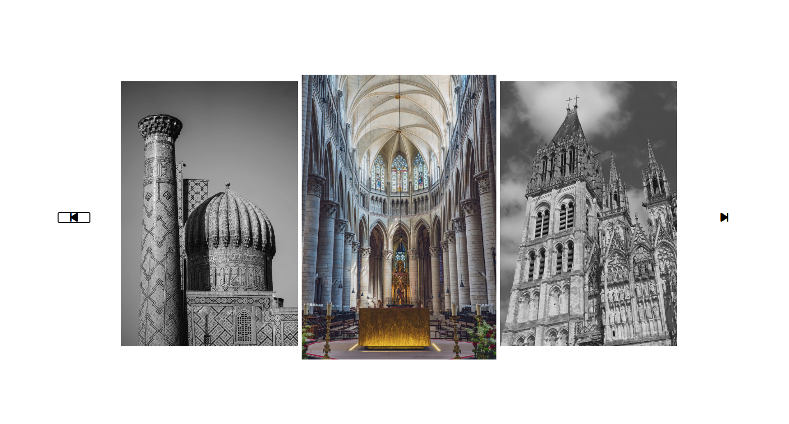

# 🖼️ Horizontal Image Gallery Slider

A modern and responsive **Horizontal Image Gallery Slider** built using **HTML, CSS, and JavaScript**. Users can browse images using navigation buttons or simply scroll with the mouse wheel. The gallery also includes a beautiful grayscale-to-color hover animation.

---

## 📸 Demo

### 🌐 Live Website
👉 https://YOUR_LIVE_LINK_HERE

### 📷 Screenshot



---

## ✨ Features

- 🖼️ Horizontal image gallery
- ⬅️➡️ Previous & Next navigation buttons
- 🖱️ Mouse wheel horizontal scrolling
- 🎨 Grayscale to color hover effect
- 🔍 Smooth zoom animation on hover
- ⚡ Smooth scrolling experience
- 💻 Beginner-friendly JavaScript project

---

## 🛠️ Built With

- HTML5
- CSS3
- JavaScript (Vanilla JS)
- Font Awesome Icons

---

## 📂 Project Structure

```
Horizontal-Image-Gallery/
│
├── image/
│   ├── 1.webp
│   ├── 2.webp
│   ├── 3.webp
│   ├── 4.webp
│   ├── 5.webp
│   └── cathedral-6696373_1280.jpg
│
├── index.html
├── style.css
├── script.js
└── README.md
```

---

## 🚀 How to Run

1. Clone this repository

```bash
git clone https://github.com/your-username/Horizontal-Image-Gallery.git
```

2. Open the project folder.

3. Launch `index.html` in your browser.

---

## 💡 How It Works

- Images are arranged inside a horizontally scrollable container.
- The **Previous** and **Next** buttons scroll one full gallery section.
- Mouse wheel movement is converted into horizontal scrolling.
- Images appear in grayscale by default.
- Hovering over an image restores its original colors and adds a smooth zoom effect.

---

## 🎯 Future Improvements

- 📱 Fully responsive mobile layout
- ❤️ Lightbox image preview
- ⌨️ Keyboard navigation
- 🤏 Touch swipe support
- 🖼️ Dynamic image loading
- 🌙 Dark mode

---

## 👨‍💻 Author

**Bhaskar Yogi**

GitHub: https://github.com/your-github-username

---

## ⭐ Show Your Support

If you found this project useful, don't forget to **⭐ Star** this repository.

Happy Coding! 🚀